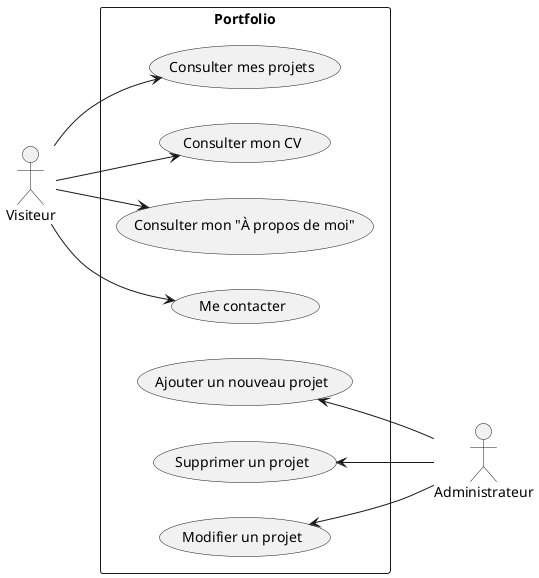

[:back: Accueil](README.md)

# Diagramme de cas d'utilisation

```plantuml
@startuml

left to right direction
actor "Visiteur" as user
actor "Administrateur" as me
rectangle Portfolio {
  usecase "Consulter mes projets" as UC1
  usecase "Consulter mon CV" as UC2
  usecase "Consulter mon "À propos de moi"" as UC3
  usecase "Me contacter" as UC4
  usecase "Ajouter un nouveau projet" as UC5
  usecase "Supprimer un projet" as UC6
  usecase "Modifier un projet" as UC7
}
user --> UC1
user --> UC2
user --> UC3
user --> UC4

UC5 <-- me
UC6 <-- me
UC7 <-- me

@enduml
```